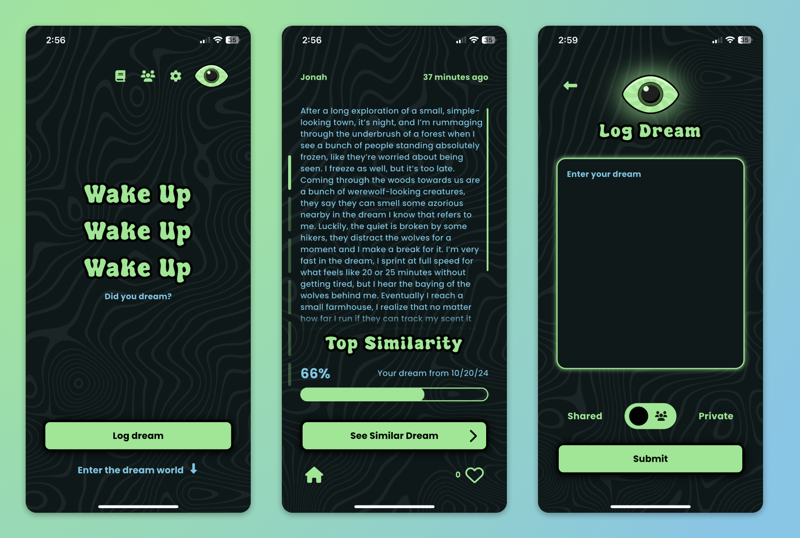
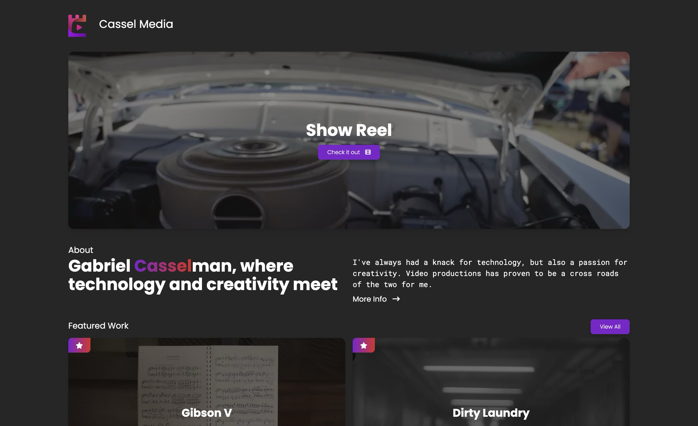
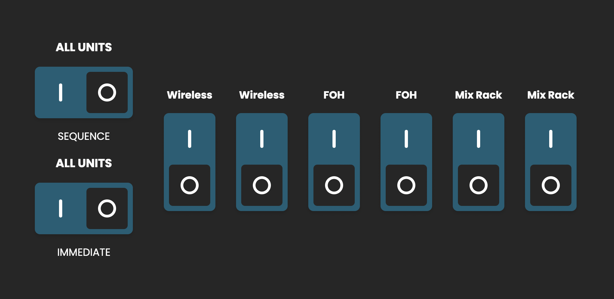
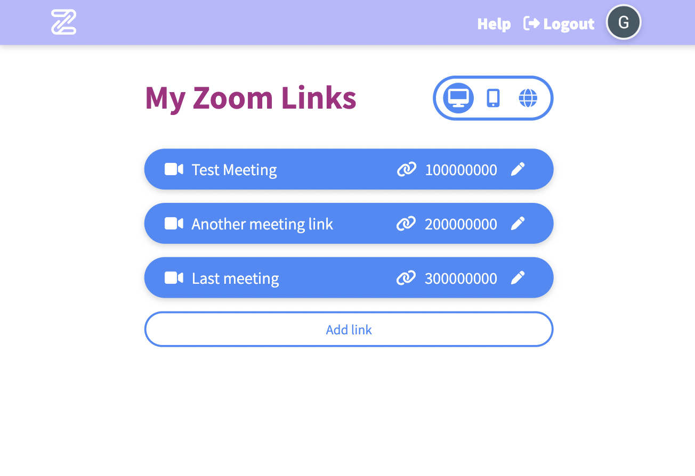

# Gabriel Casselman

*REPO*rtfolio (get it cause its a git repo haha)

A collection of my work in the **media technology** space,
along with other software projects and some production experience.

## About

 - 2nd year student at the [Rochester Institute of Technology (RIT)](https://www.rit.edu/).
 - Studying [Motion Picture Science](https://www.rit.edu/study/motion-picture-science-bs)
 - Accumulated key experience while still at early in career
     - Worked in production environment
     - Deployed media software solutions
 - [SMPTE](https://www.smpte.org/who-we-are) 2024 [scholarship](https://www.smpte.org/about/awards-programs/louwolf-winners) awardee

[Creative Portfolio](https://casselmedia.com)

[Mechatronics Portfolio](https://2023mechatronicsgabrielcasselman.weebly.com/capstone)

## Projects

### Dreamcatcher

 - Full stack personal side project, co-created with [Jonah Witte](linkedin.com/in/jonah-witte-202928302)
 - Social app for logging & sharing dreams
 - LLM embedding for finding similarities between dreams

 Technology:
 - Backend - Golang
 - Database - Postgres + pg_vector
 - Frontend - Flutter
 - Deployment - Docker, Docker Compose, Nginx, DigitalOcean
 - Currently in beta testing phase, deployed to TestFlight

### Casselmedia

 casselmedia.com

 Creative portfolio site, hand designed & coded

 Technology:
 - Framework - Svelte & SvelteKit
 - Styling - Tailwind
 - Deployment - Netlify
 - Markdown w/ frontmatter metadata
 - Animation w/ GSAP

### Xtreme Power Controller

 - User friendly web interface for [Xtreme switched PDUs](https://www.xpcc.com/products/spd/)
 - Additional sequencing capabilities.
 - Currently deployed in religious institution AV use-case

Technology:
 - Backend - Golang 
 - Framework (if you can call it that!) - HTMX
 - Styling - Tailwind
 - Reverse engineered PDU's Telnet interface
 - Deployment - [Banana Pi](https://www.banana-pi.org/en/banana-pi-sbcs/165.html) single board computer w/ Raspberry Pi OS Lite on premise, 3D printed case

 

### Roasting Plant Signage

 - Custom [Brightsign](https://www.brightsign.biz/) page
 - Listens to coffee roasting robot ([Roasting Plant's Javabot](https://roastingplant.com/pages/roasting-plant-coffee-javabot-story))
 - Displays currently roasting bean

Deployed in two locations

Technology:
 - Brightsign digital signage players
 - HTML & vanilla JavaScript
 - Listens UDP messages with Brightsign provided API
 - Styling - SCSS
 - Build tool - Grunt

 

### Zlink

[zlink-33007.web.app](https://zlink-33007.web.app/#/)

[source code](https://github.com/GICMan/zlink)

 - COVID era zoom link manager
 - Launch meetings with one click
 - Mobile friendly

Technology:
 - Framework: Vue.js
 - Backend: Firebase

 

## Production Experiences

### [DPNews](https://dpnews.org/)

 - [Nationally recognized](https://www.independent.com/2023/04/01/dp-news-awarded-among-best-in-the-nation-for-student-journalism/) high school news program
 - [Technical director and producer](https://www.independent.com/2022/11/02/dp-news-local-high-schoolers-run-the-show-in-goleta/)
 - Earned numerous awards through the [Student Television Network (STN)](https://www.studenttelevision.com/our-mission) and others

**Skills Learned**

 - Foundations of production: writing, lighting, shooting, editing, **storytelling**
 - Broadcast engineering: SDI & networked video, software & hardware switching solutions, virtual sets, live graphics, media playback, audio routing and mixing
 - Team motivation, production organization, training others 

### [Music Academy of the West](https://musicacademy.org/about-us/)

 - Recruited during 3rd year of high school
 - Brought technical expertise to establish archival video recording workflow
 - Recorded hundreds of hours of classical music performances

**Skills Learned**

 - Data management, long form recording, single operator multi-cam systems
 - Fast paced production, time management, professional communication
 - Small team leadership, team workflows, in-process troubleshooting 

### [RIT Marketing](https://www.rit.edu/marketing/video-production)

 - Started as production assistance, moved to videographer
 - Hands on run & gun shooting
 - Large team environment 

 **Skills Learned**

 - Equipment handling, quick setup & tear down
 - Aesthetics, storytelling from marketing point of view
 - Large team workflows and communications
